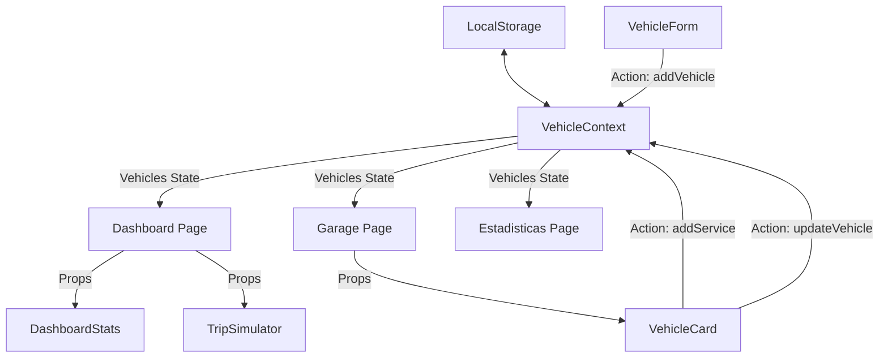

# Documentación de Arquitectura del Sistema

## 1. Visión General de la Arquitectura

El proyecto está construido como una **Single Page Application (SPA)** moderna utilizando **React 18** y **Vite** como bundler. La arquitectura sigue un patrón basado en componentes y utiliza la **Context API** de React para la gestión del estado global, eliminando la necesidad de librerías externas complejas como Redux para este alcance.

### Stack Tecnológico
- **Core**: React 18, JavaScript (ES6+).
- **Build Tool**: Vite (Rápido HMR y optimización de build).
- **Estilos**: Tailwind CSS v3 (Utility-first, diseño responsivo y tema personalizado "COD MW").
- **Persistencia**: LocalStorage (Persistencia de datos del lado del cliente).

## 2. Flujo de Datos (Data Flow)

El flujo de datos es unidireccional y centralizado a través del `VehicleContext`.



1.  **Fuente de Verdad**: `VehicleContext` mantiene el estado de `vehicles` (array de objetos).
2.  **Inicialización**: Al cargar la app, el Context hidrata el estado leyendo del `localStorage`.
3.  **Consumo**: Componentes como `VehicleCard` y `Estadisticas` se suscriben al contexto para recibir actualizaciones en tiempo real.
4.  **Mutación**: Las acciones (`addVehicle`, `addService`) se despachan desde los componentes UI, actualizan el Context y sincronizan automáticamente con `localStorage`.

## 3. Estructura del Proyecto

La estructura de directorios sigue una organización semántica y modular:

```
src/
├── components/       # Componentes UI reutilizables y de presentación
│   ├── VehicleCard.jsx    # Tarjeta principal de visualización de vehículo
│   ├── ServiceForm.jsx    # Formulario modal para registro de mantenimiento
│   ├── DashboardStats.jsx # Panel de KPIs y gráficos
│   └── TripSimulator.jsx  # Herramienta de simulación de rutas
├── context/          # Lógica de estado global
│   └── VehicleContext.jsx # Provider y lógica de negocio (CRUD)
├── pages/            # Vistas principales (Rutas)
│   ├── Dashboard.jsx      # Vista principal (Centro de Mando)
│   ├── Garage.jsx         # Gestión de flota
│   └── Estadisticas.jsx   # Análisis detallado
└── utils/            # Funciones auxiliares puras y constantes
    ├── calculations.js    # Lógica matemática (Costo/Km, Riesgo)
    ├── formatters.js      # Formato de moneda y fechas (i18n)
    ├── pdfGenerator.js    # Generación de reportes PDF
    └── constants.js       # Datos estáticos (Catálogos MX)
```

## 4. Justificación de Librerías

### `jspdf` & `jspdf-autotable`
**Propósito**: Generación de reportes de mantenimiento en formato PDF.
**Justificación**: Permite la generación de documentos **100% en el cliente** (Client-side), garantizando la privacidad de los datos (no se envían a un servidor) y permitiendo la funcionalidad offline. `autotable` facilita la creación de tablas complejas con estilos personalizados (Header táctico).

### `recharts`
**Propósito**: Visualización de datos (Gráficos de barras).
**Justificación**: Librería construida específicamente para React, basada en componentes composables. Es ligera, flexible y utiliza SVG para el renderizado, lo que asegura nitidez en cualquier resolución. Su API declarativa se integra perfectamente con el flujo de datos de React.

### `lucide-react`
**Propósito**: Iconografía del sistema.
**Justificación**: Provee un set de iconos consistente, moderno y altamente legible. Es **tree-shakeable** (solo se incluye en el bundle lo que se usa), lo que optimiza el rendimiento de la aplicación.

### `tailwindcss`
**Propósito**: Sistema de diseño y estilizado.
**Justificación**: Permite un desarrollo rápido mediante clases de utilidad. La configuración personalizada (`tailwind.config.js`) facilita la implementación de un **Design System** coherente (Colores "COD MW", tipografías, espaciados) en toda la aplicación sin escribir CSS tradicional propenso a errores de especificidad.
